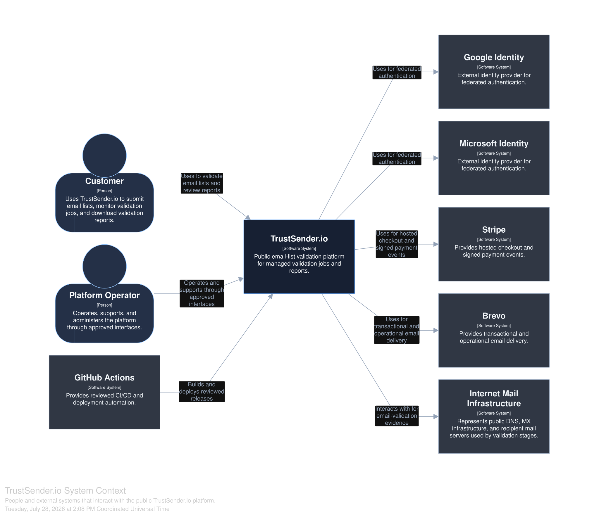
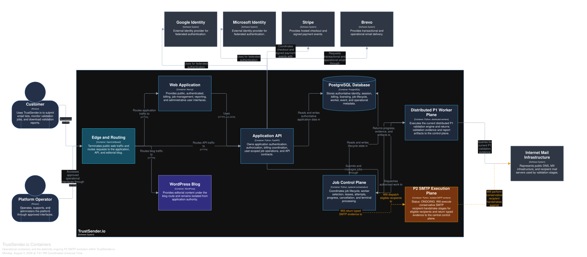

# TrustSender.io Engineering Portfolio

This repository is a public, sanitized visual engineering portfolio and architecture whitepaper for TrustSender.io. It is intended to communicate approved system context and design decisions without exposing sensitive or proprietary material. The production source code and internal documentation remain private.

## Architecture at a glance

The intended architecture stack includes Next.js, FastAPI, PostgreSQL, distributed workers, Stripe, WordPress, and GitHub Actions. References in this portfolio remain deliberately high-level until they can be represented through reviewed, sanitized architecture models.

## Delivery status

- **P1 distributed validation — Operational**
- **P2 SMTP evolution — ONGOING**

P2 is not represented as operational. Its documentation will evolve only as approved information becomes suitable for public release.

## Architecture model

The canonical public architecture is maintained as text in [`architecture/workspace.dsl`](architecture/workspace.dsl). Its sanitized scope and modeling conventions are documented in [`architecture/model-notes.md`](architecture/model-notes.md).

## Architecture diagrams

### System Context

The System Context view shows the people and external systems that interact with the public TrustSender.io platform. Click the diagram to open the full SVG.

### Container View

The Container View shows the operational application, data, editorial, control-plane, and distributed P1 components. The P2 SMTP Execution Plane is shown separately as `ONGOING`, not operational. Solid relationships represent operational interactions; amber dashed relationships represent ongoing evolution. Click the diagram to open the full SVG.

## Architecture validation

GitHub Actions validates the canonical Structurizr DSL and generates dark-mode architecture previews for review. Publication-ready SVGs are committed only after model validation, visual inspection, and public-safety inspection.

## Roadmap

1. Canonical C4 model with Structurizr DSL
2. Dark-mode D2 engineering overview
3. Multi-level architecture diagrams
4. Sanitized engineering metrics
5. GitHub Pages visual whitepaper

## Repository contents

- `architecture/` contains the reviewed canonical public architecture model and supporting narratives.
- `visuals/` defines the presentation direction for the visual whitepaper.
- `diagrams/` contains reviewed publication-ready architecture diagrams.
- `metrics/` defines a schema for future sanitized aggregate metrics.
- `scripts/` contains reviewed architecture validation and rendering utilities.
- `assets/` is reserved for approved publication assets and icons.

All public content must follow the safety and review requirements in [`AGENTS.md`](AGENTS.md).
