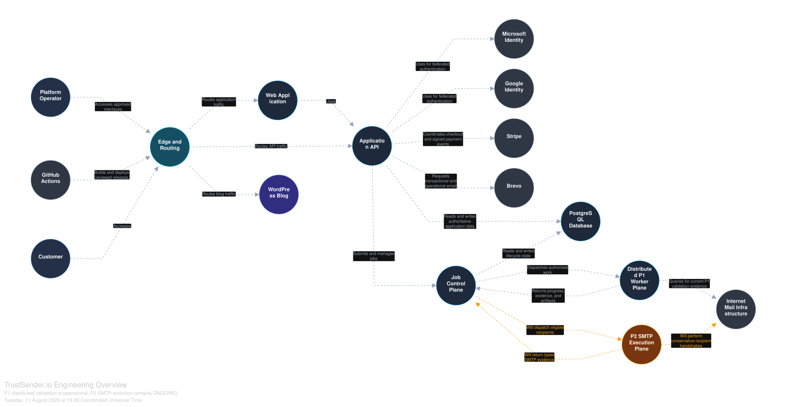

# TrustSender.io Engineering Portfolio

**A public engineering case study of a distributed email validation SaaS.**

TrustSender.io is designed for high-volume validation of bulk cold email lists. The product combines a layered verification model, distributed validation execution, clear result classification and Day Pass access for users who prefer active validation windows instead of recurring subscriptions.

This portfolio focuses on the engineering behind the product: system boundaries, application authority, durable state, distributed execution, external integrations and deliberate separation between operational architecture and ongoing evolution.

## Product at a glance

- **14 verification layers** across syntax, domain, mail infrastructure, risk, quality and history signals.
- **3 actionable result classes:** deliverable, risky and undeliverable.
- **24-hour Day Pass windows** with unlimited verification while a pass is active.
- **No monthly subscription required** for the Day Pass model.
- **SMTP-aware validation workflow** as part of the product's verification direction.
- **Privacy-focused handling** with authenticated processing, limited retention and automatic purging policies.

## Engineering scope

TrustSender.io brings together:

`Next.js` · `FastAPI` · `PostgreSQL` · `Distributed Workers` · `Stripe` · `WordPress` · `GitHub Actions` · `Structurizr`

The architecture demonstrates separation between product experience, API authority, persistent state, validation control, distributed execution, editorial content and third-party services.

## Architecture

### Engineering Overview

The primary system view shows product experience, application authority, PostgreSQL, validation control, the distributed P1 worker plane, external services and the evolving P2 SMTP Execution Plane.

### System Context

The C4 System Context view shows people, TrustSender.io and the external systems surrounding the product boundary.

### Container View

The C4 Container View shows the major application, data, editorial, control-plane and execution responsibilities.

## Delivery status

- **P1 distributed validation — Operational**
- **P2 SMTP evolution — ONGOING**

The portfolio deliberately keeps delivered architecture visually distinct from active engineering work.

## Engineering principles demonstrated

- Clear separation of frontend, API, data, editorial and execution responsibilities.
- Distributed processing for high-volume validation workloads.
- Explicit application authority and durable workflow state.
- Isolated editorial responsibility rather than coupling the CMS to product authority.
- Controlled integration with identity, payments and external services.
- CI/CD as part of the engineering lifecycle.
- Privacy-focused handling of uploaded list data.
- Architecture documentation that makes system evolution visible.

## Public product links

- [TrustSender.io](https://trustsender.io/)
- [Product context](https://trustsender.io/docs/for-llms)
- [Pricing](https://trustsender.io/pricing)

---

This repository is a public architecture and engineering case study. It is not a source-code distribution and does not expose private operational details.
